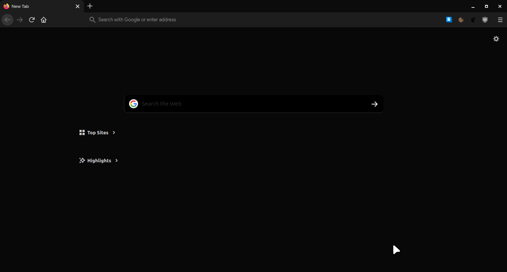
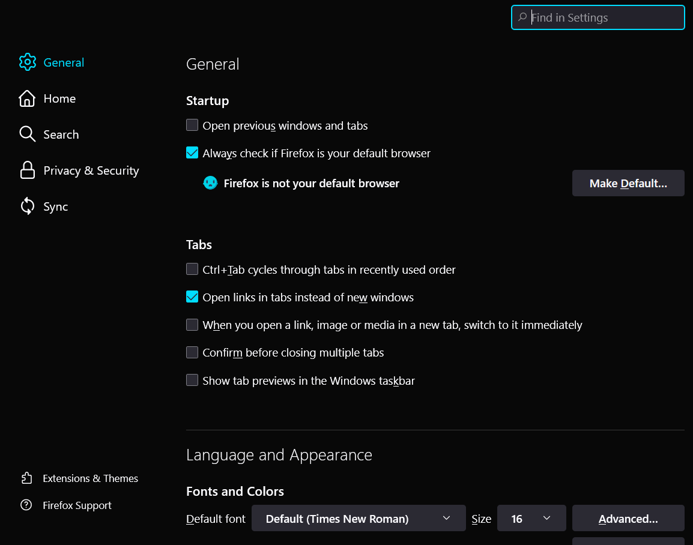
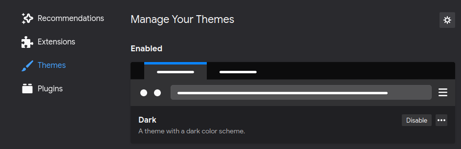

# Plateau-Dark-Firefox-Theme

My own CSS config for a dark firefox theme, [slightly based on plata GTK](https://gitlab.com/tista500/plata-theme). Thought i could share it :)

## How to install

#### Set the default firefox dark theme as current theme
Firefox won't accept the dark colors from this theme unless we are using its dark theme.

#### Enable userChrome customization in about:config

- Navigate to about:config in the address bar and accept the risks.

- Search for toolkit.legacyUserProfileCustomizations.stylesheets and toggle it to true (by double clicking on it).

#### Locate and open your profile folder

Either of the following two methods work:

- Using the Firefox troubleshooting page
  
  - Click on ☰ ➝ Help ➝ Troubleshooting Information or navigate to about:support in your address bar
  
  - Under Application Basics, click on the the Open Folder button. You should now see your profile folder.

#### Save the files

- Create a new folder called _chrome_.

- Copy the files _userChrome.css_ and _usercontent.css_ inside that folder.
